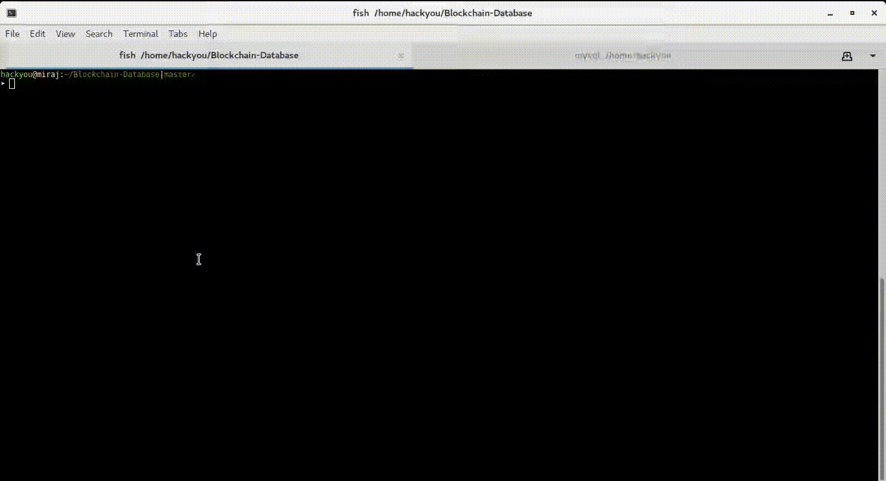

# Detecting Insider Attacks on Databases using Blockchain
Here is a Demo of its working :smiley:.

Note that during the Demo, *Multichain* was already running on the system (single node).

## Schema of the Database

* #### Credentials Table
    
    |Field|Type|Null|Key|
    |:---:|:---:|:---:|:---:|
    |uid|varchar(128)|NO|PRI|
    |salt|varchar(64)|YES||
    |hash|varchar(64)|YES||

* #### Grades Table

    |Field|Type|Null|Key|
    |:---:|:---:|:---:|:---:|
    |uid|varchar(128)|NO|PRI|
    |course|varchar(10)|NO|PRI|
    |grade|varchar(2)|YES||
    |txid|varchar(64)|YES||
    |identifier|varchar(128)|YES||

## Commands for Multichain:
1. **Start Node**
    * `$ multichain-util create chain1`
    * `$ multichaind chain1 -daemon`
    
2. **Create Streams**
    * `$ create stream stream1 false`
    * `$ subscribe stream1`
    * `$ create stream pubkey false`
    * `$ subscribe pubkey`
    * `$ create stream instructor false`
    * `$ subscribe instructor`
    
3. **Publish the courses of instructors** (*Course is hex encoded*)
    * `$ publish instructor ss 6373333137`
    * `$ publish instructor ss 6373333837`
    * `$ publish instructor puru 6373333837`
---

 > ### A full Report of the ***Protocol*** and the ***Implementation*** can be [found here](BlockchainDB_Report.pdf).
